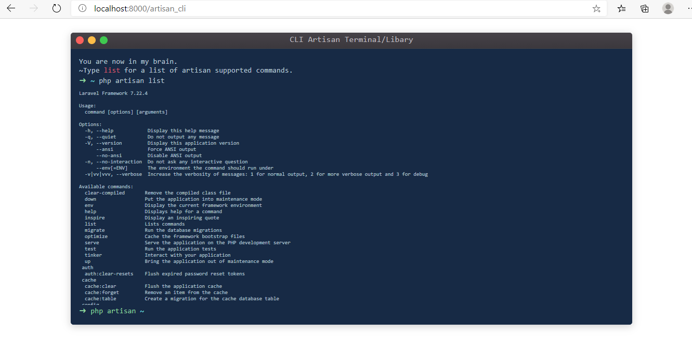

# laravel:artisan_cli
Cli simulator package for [laravel:artisan]
# Requirements
   -  `php ^7.3`
# Installation
Just install package:
   - `composer require omid51068/artisan-cli`
   - `php artisan vendor:publish --provider="artisan_cli\gui\artisanCliServiceProvider"`
   - Set your middleware in config/artisan_cli.php, the default is `admin`
# Running command
Simply go to http://you-domain.com/artisan_cli
